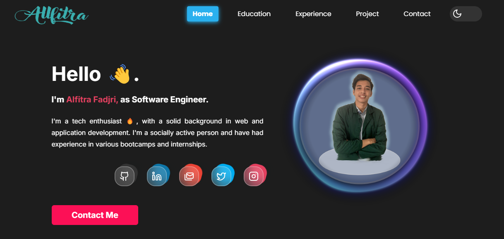

# My Portofolio || Alfitra Fadjri



## About

Welcome to my personal portfolio repository, this is a repository for a portfolio website that showcases my resume and the activities I have accomplished.

## Getting Started

1. Clone the repository:

```
$ git clone https://github.com/allfitra/Allfitra-Portofolio.git
```

2. Install dependencies:

```
$ npm install
```

3. Run the development server:

```
$ npm run dev
```

4. Explore, contribute, and enjoy!

## Support and Contact

For any issues or queries, feel free to reach out to us on [My social media](https://www.linkedin.com/in/alfitra-fadjri/).

# Thank You
